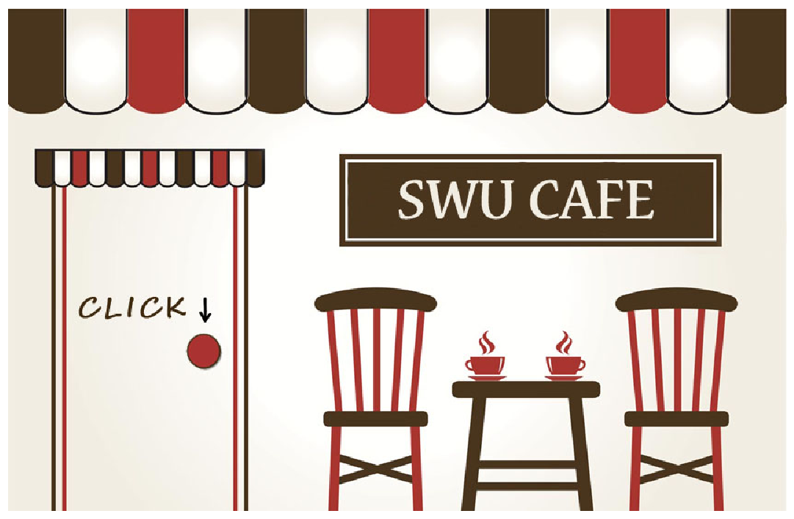
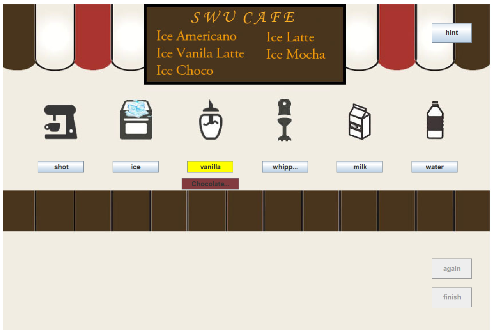

# Project: Simple-Making-Coffee-Game
### used tool

-   **Java: Eclipse
-   **Library: Swing 

### Project Overview

1. Main window has coffee, ice, sauces (vanilla, chocolate), whipped, milk, and water.
2. A user can make a drink using the items.
3. If the user makes a drink in the recipe, the user will see a successful image.
4. The user can see the recipe by pressing the hint button.

# Program Imgae

### First Window

- Press the door handle. 

### Second Window

- Screen for making drinks

